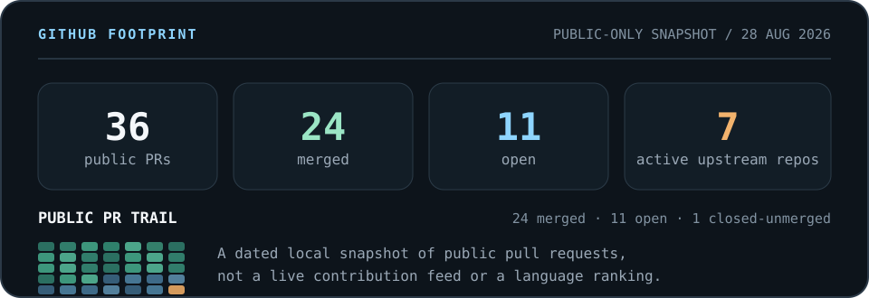

<!--
  Visual direction: a real spectral workflow leads; authored identity,
  capability groups, and contribution proof follow. Local SVGs carry
  the visual system without third-party stats or badge services.
-->

  

  

Click the preview to open the full muted demo. 10.75 s, 1920x1080, 60 fps, 400-690 nm.

> I build reliable AI applications end to end, connecting product interfaces, agent workflows, APIs, and data systems. Computational imaging is my technical edge.

  <code>AI applications</code>&nbsp;&nbsp;
  <code>frontend + client systems</code>&nbsp;&nbsp;
  <code>agent workflows</code>&nbsp;&nbsp;
  <code>computational imaging</code>

## About

I turn AI capabilities into products people can use: streaming interfaces, local client workflows, orchestration, APIs, and data delivery. My main lane is AI full-stack engineering, with computational imaging and open-source collaboration adding technical depth.

## Engineering focus

- **AI application engineering**: turning LLM and agent capabilities into product flows across UI, orchestration, APIs, and data.
- **Frontend and client engineering**: building streaming interfaces, desktop workflows, device-facing controls, and cross-platform behavior.
- **Agent workflows and data systems**: working with RAG, DAG execution, model routing, MCP, SSE, RBAC, state, and storage.
- **Computational imaging**: turning reconstruction research into usable software through camera acquisition, spectral visualization, and result handling.

## Core stack

  

- **Interface**: HTML5, CSS3, JavaScript, TypeScript, React, React Flow, Zustand, Vite, Webpack, and Rspack.
- **AI applications**: LLM agents, RAG, LangChain, LangGraph, MCP tool calling, model routing, SSE, and WebSocket workflows.
- **Services and data**: Node.js, NestJS, Python, PyTorch, PostgreSQL, pgvector, Redis, DAG execution, RBAC, snapshots, and structured diff or rollback.
- **Client delivery**: Rust, Tauri, Git, Windows tooling, PyInstaller, camera workflows, and desktop result handling.

## AI coding workflow

My coding-agent toolkit includes Kimi Code, Codex, Pi, Claude Code, Hermes, OpenCode, and ZCode. I use these tools inside a human-led loop: understand the codebase, implement the change, test edge cases, document decisions, and review the result.

  
    &nbsp;
    &nbsp;
    &nbsp;
    &nbsp;
    &nbsp;
    &nbsp;
    
  
  Kimi Code / Codex / Pi · Claude Code / Hermes / OpenCode / ZCode

## What the demo shows

This is an **earlier private hyperspectral reconstruction prototype**, co-developed in a two-person team. The public loop and full demo show a desktop workflow for camera acquisition, lightweight deep-learning reconstruction, 30-band spectral display across 400-690 nm, per-point spectral curves, and result saving.

I was responsible for the lightweight deep-learning reconstruction and dataset work, plus the camera acquisition, desktop UI, spectral visualization, and result-saving modules. Code and data remain private because of research and industry-collaboration constraints.

## GitHub footprint

I am using a dated local snapshot instead of a live stats service. GitHub currently returns no language bytes for my three owned repositories, so a Most Used Languages chart would not represent my working stack.

  

Snapshot: 28 Aug 2026. Counts are time-bound; open work is shown as collaboration in review, not as shipped product.

## Open-source contributions

I work on real issues across AI agent systems, desktop UX, web tooling, civic data, and cross-platform behavior.

### Contribution map

- **Civic data delivery** · [open-city-ai/haidian](https://github.com/open-city-ai/haidian) · `25 PRs · 23 merged · 2 open` Structured submissions, geometry sources, deterministic artifacts, and review semantics.
- **AI agent systems** · [agentscope-ai/agentscope](https://github.com/agentscope-ai/agentscope) · `2 open` AI system correctness and Windows subprocess behavior.
- **Agent memory and Node.js** · [TencentCloud/TencentDB-Agent-Memory](https://github.com/TencentCloud/TencentDB-Agent-Memory) · `3 open` Proxy preservation, SQLite filtering, and self-healing store state.
- **Code review tooling** · [alibaba/open-code-review](https://github.com/alibaba/open-code-review) · `1 open` Go configuration and Jinja template support for review workflows.
- **Desktop UX** · [desktop/desktop](https://github.com/desktop/desktop) · `1 open` React and TypeScript pull-request state and suggestion behavior.
- **Web tooling** · [parcel-bundler/parcel](https://github.com/parcel-bundler/parcel) · `1 open` Correct UTF-8 BOM JSON parsing in the resolver path.
- **Search and coordinates** · [organicmaps/organicmaps](https://github.com/organicmaps/organicmaps) · `1 open` C++ search behavior for space-separated DMS coordinates.

One additional merged documentation PR lives in [26.6.13-codex1#2](https://github.com/dvd233/26.6.13-codex1/pull/2); it is counted separately from upstream work.

### Merged proof

  
<strong>Complete delivery · bilingual formal submission · merged</strong>

  **Problem**: A civic-data submission needed a complete, reviewable package rather than an unsupported concept.

  **Contribution**: I delivered a scoped 41-file bilingual package spanning narrative, offline HTML/PDF, GeoJSON, metrics, sources, a manifest, and deterministic self-checks, while marking provisional geometry and non-endorsement boundaries.

  **PR**: [open-city-ai/haidian#2540](https://github.com/open-city-ai/haidian/pull/2540) · merged for repository intake, not gallery publication or government endorsement.

  
<strong>Site provenance · merged</strong>

  **Problem**: Provisional site inputs lacked consistent dates, hashes, licence and use boundaries, while an empty constraints layer could be mistaken for proof that no controls existed.

  **Contribution**: I added a built-ins-only audit for four submitted geometries, recorded six missing official-control layers, and made replacement triggers and permitted uses traceable across the package. The merged change passed 18/18 audit checks.

  **PR**: [open-city-ai/haidian#3525](https://github.com/open-city-ai/haidian/pull/3525)

  
<strong>Windows portability · import and worker locking · merged</strong>

  **Problem**: An unconditional <code>fcntl</code> import stopped two test modules from being collected on Windows, and worker-lock contention needed consistent cross-platform semantics.

  **Contribution**: I reproduced the failure, introduced the guarded POSIX and Windows lock path, and added the initial regression. Maintainer review then corrected the production file-open path and strengthened its test; the previously uncollectable target suite passed 21/21 tests.

  **PR**: [open-city-ai/haidian#3859](https://github.com/open-city-ai/haidian/pull/3859)

  
<strong>Deterministic artifacts · LF across platforms · merged</strong>

  **Problem**: Three writer paths emitted CRLF on Windows, creating whole-file diff noise and breaking byte-hash consistency after line-ending normalization.

  **Contribution**: I made the writers emit LF bytes and added direct plus end-to-end regressions. After review exposed a Python 3.9 compatibility issue, I revised the implementation and revalidated both flows.

  **PR**: [open-city-ai/haidian#3915](https://github.com/open-city-ai/haidian/pull/3915)

  
<strong>Review semantics · blockers versus future follow-ups · merged</strong>

  **Problem**: A flat review-action list converted future conditions into immediate change requests, creating an intake loop that compliant edits could not close.

  **Contribution**: I introduced explicit non-blocking follow-ups with trigger and owner fields, invalidated legacy review caches, and kept current or malformed repairs fail-closed with focused regression coverage.

  **PR**: [open-city-ai/haidian#3982](https://github.com/open-city-ai/haidian/pull/3982); the original blocked head was re-reviewed and merged without weakening existing gates.

Latest merged follow-through: [open-city-ai/haidian#4011](https://github.com/open-city-ai/haidian/pull/4011), publish bounded per-dimension repairs in PR comments.

### In review now

  
<strong>AI agent systems · 5 open PRs</strong>

  - [agentscope-ai/agentscope#2434](https://github.com/agentscope-ai/agentscope/pull/2434): disable Uvicorn hot reload on Windows so subprocess execution keeps a compatible event loop.
  - [agentscope-ai/agentscope#2435](https://github.com/agentscope-ai/agentscope/pull/2435): preserve <code>encrypted_content</code> on Responses reasoning items for stateless multi-turn calls.
  - [TencentCloud/TencentDB-Agent-Memory#1171](https://github.com/TencentCloud/TencentDB-Agent-Memory/pull/1171): keep Node's global proxy dispatcher intact while loading <code>undici@8</code>.
  - [TencentCloud/TencentDB-Agent-Memory#1172](https://github.com/TencentCloud/TencentDB-Agent-Memory/pull/1172): self-heal the store-init cache after failed initialization or a closed store.
  - [TencentCloud/TencentDB-Agent-Memory#1173](https://github.com/TencentCloud/TencentDB-Agent-Memory/pull/1173): honor <code>recordIds</code> filtering in the SQLite L1 query path.

  
<strong>Frontend, client, and tooling · 4 open PRs</strong>

  - [alibaba/open-code-review#1056](https://github.com/alibaba/open-code-review/pull/1056): add Jinja template support to the review configuration flow.
  - [desktop/desktop#22767](https://github.com/desktop/desktop/pull/22767): hide pull-request suggestions when a branch has no commits ahead of the default branch.
  - [parcel-bundler/parcel#10352](https://github.com/parcel-bundler/parcel/pull/10352): parse UTF-8 BOM JSON correctly in the resolver path.
  - [organicmaps/organicmaps#13423](https://github.com/organicmaps/organicmaps/pull/13423): support space-separated DMS coordinates in search.

  
<strong>Civic data workflow · 2 open PRs</strong>

  - [open-city-ai/haidian#3821](https://github.com/open-city-ai/haidian/pull/3821): expose synthetic-capacity gates in review carriers; currently in upstream review.
  - [open-city-ai/haidian#4106](https://github.com/open-city-ai/haidian/pull/4106): add a CJK font screenshot regression for the rendered artifact flow; currently in upstream review.

## Education

Master's student at BUPT, Electronic Engineering and Information Photonics 
Undergraduate background in Network Engineering at BUPT

## Contact

[dvd@linux.do](mailto:dvd@linux.do) · [z1403594118@gmail.com](mailto:z1403594118@gmail.com)

  

