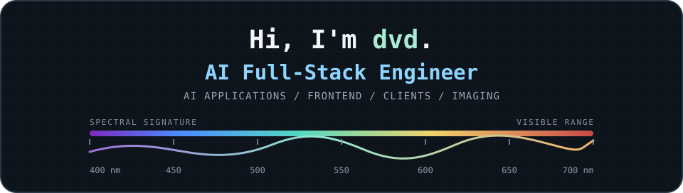
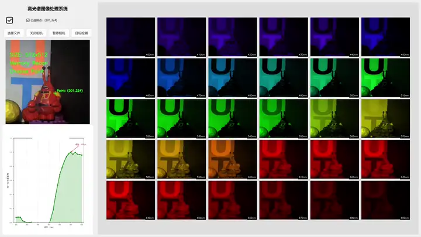
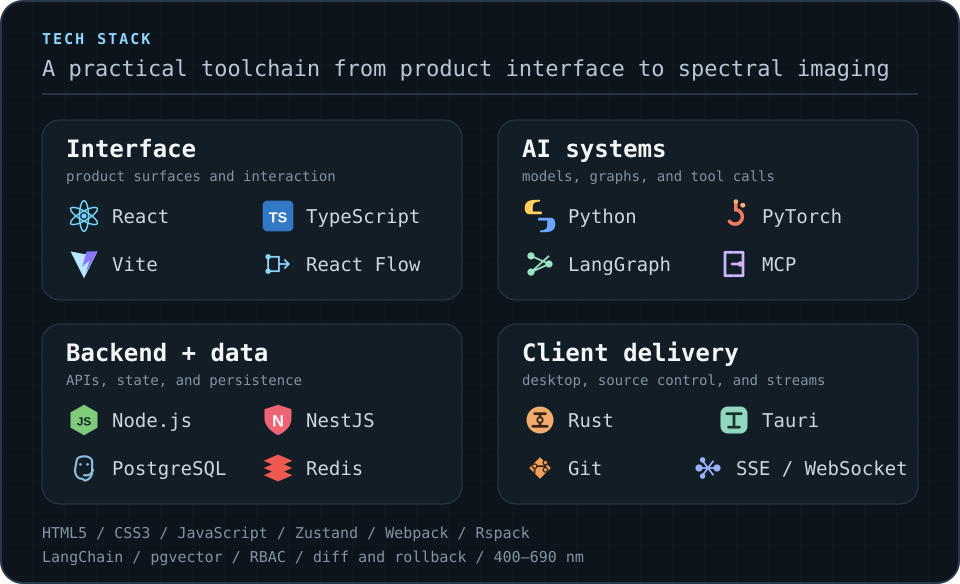
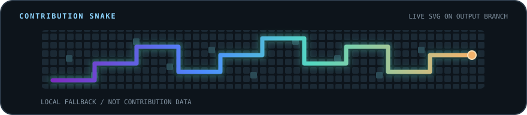
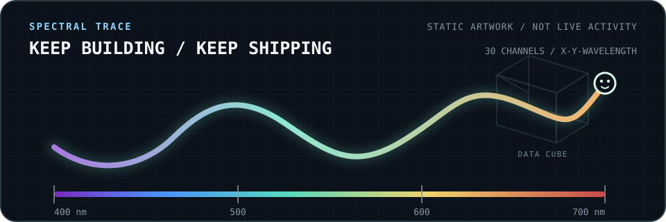

<!--
  Visual direction: a real spectral workflow leads; authored identity,
  capability groups, and contribution proof follow. Local SVGs carry
  the visual system, while the contribution snake, footprint table,
  trophy, streak, and calendar cards are generated by scheduled GitHub
  Actions from public activity data.
-->

  

  

  

Click the preview to play the full demo (muted) · 10.75 s · 1920x1080 · 60 fps · 400-690 nm.

## What the demo shows

This is an **earlier private hyperspectral reconstruction prototype**. The public loop and full demo show a desktop workflow for camera acquisition, lightweight deep-learning reconstruction, 30-band spectral display across 400-690 nm, per-point spectral curves, and result saving.

I was responsible for the lightweight deep-learning reconstruction and dataset work, plus the camera acquisition, desktop UI, spectral visualization, and result-saving modules. Code and data remain private because of research and industry-collaboration constraints.

> I build reliable AI applications end to end, connecting product interfaces, agent workflows, APIs, and data systems. Computational imaging is my technical edge.

  <code>AI applications</code>&nbsp;&nbsp;
  <code>frontend + client systems</code>&nbsp;&nbsp;
  <code>agent workflows</code>&nbsp;&nbsp;
  <code>computational imaging</code>

## About

I turn AI capabilities into products people can use: streaming interfaces, local client workflows, orchestration, APIs, and data delivery. My main lane is AI full-stack engineering, with computational imaging and open-source collaboration adding technical depth.

## Engineering focus

- **AI application engineering**: turning LLM and agent capabilities into product flows across UI, orchestration, APIs, and data.
- **Frontend and client engineering**: building streaming interfaces, desktop workflows, device-facing controls, and cross-platform behavior.
- **Agent workflows and data systems**: working with RAG, DAG execution, model routing, MCP, SSE, RBAC, state, and storage.
- **Computational imaging**: turning reconstruction research into usable software through camera acquisition, spectral visualization, and result handling.

## Tech stack

  

- **Interface**: HTML5, CSS3, JavaScript, TypeScript, React, React Flow, Zustand, Vite, Webpack, and Rspack.
- **AI applications**: LLM agents, RAG, LangChain, LangGraph, MCP tool calling, model routing, SSE, and WebSocket workflows.
- **Services and data**: Node.js, NestJS, Python, PyTorch, PostgreSQL, pgvector, Redis, DAG execution, RBAC, snapshots, and structured diff or rollback.
- **Client delivery**: Rust, Tauri, Git, Windows tooling, PyInstaller, camera workflows, and desktop result handling.

## AI coding workflow

My coding-agent toolkit includes Kimi Code, Codex, Pi, Claude Code, Hermes, OpenCode, and ZCode. I also follow DeepSeek Harness within the broader agent tooling ecosystem. I use these tools inside a human-led loop: understand the codebase, implement the change, test edge cases, document decisions, and review the result.

  

    

      &nbsp;<strong>Kimi Code</strong>&ensp;
      &nbsp;<strong>Codex</strong>&ensp;
      &nbsp;<strong>Pi</strong>&ensp;
      &nbsp;<strong>Claude Code</strong>
        
      &nbsp;<strong>Hermes</strong>&ensp;
      &nbsp;<strong>OpenCode</strong>&ensp;
      &nbsp;<strong>ZCode</strong>&ensp;
      &nbsp;<strong>DeepSeek Harness</strong>
    

  

## 🌐 Open-source contributions

I work on real issues across AI agent systems, frontend ecosystems, desktop and web tooling, and civic data. As of 2026-09-01, **32 PRs are merged across six upstream projects**, with 24 more in review.

### 🏆 Merged proof

Recently merged across major AI agent and frontend ecosystems:

- 🐜 [ant-design/ant-design#59173](https://github.com/ant-design/ant-design/pull/59173) · ⭐ 99.3k — fixed the Chinese contribution guide to link the English locale list in its i18n step, so contributors update both locale lists.
- 🤖 [agentscope-ai/agentscope#2434](https://github.com/agentscope-ai/agentscope/pull/2434) · ⭐ 30.3k — Uvicorn hot reload forced a SelectorEventLoop on Windows and broke subprocess execution; disabling reload on Windows keeps a compatible event loop.
- 🔍 [alibaba/open-code-review#1114](https://github.com/alibaba/open-code-review/pull/1114) · ⭐ 21.8k — added Pug template support to the review allowlist, with a dedicated rule covering escaping contexts, attribute spreads, and URL sinks.
- ⚛️ [alibaba/hooks#2956](https://github.com/alibaba/hooks/pull/2956) · ⭐ 15.0k — kept `useLatest` and `useUnmountedRef` returns as non-nullable `MutableRefObject` across the supported React type versions, backed by declaration-emission regression tests.
- 🍒 [Tencent/cherry-markdown#1871](https://github.com/Tencent/cherry-markdown/pull/1871) · ⭐ 4.9k — guarded pending image load and error callbacks after previewer destroy, so late events no longer touch torn-down state.

**27 merged PRs in [open-city-ai/haidian](https://github.com/open-city-ai/haidian)** — selected deep dives:

  
<strong>🥇 Complete delivery · bilingual formal submission</strong>

  **Problem**: A civic-data submission needed a complete, reviewable package rather than an unsupported concept.

  **Contribution**: I delivered a scoped 41-file bilingual package spanning narrative, offline HTML/PDF, GeoJSON, metrics, sources, a manifest, and deterministic self-checks, while marking provisional geometry and non-endorsement boundaries.

  **PR**: [open-city-ai/haidian#2540](https://github.com/open-city-ai/haidian/pull/2540) · merged for repository intake, not gallery publication or government endorsement.

  
<strong>🔎 Site provenance</strong>

  **Problem**: Provisional site inputs lacked consistent dates, hashes, licence and use boundaries, while an empty constraints layer could be mistaken for proof that no controls existed.

  **Contribution**: I added a built-ins-only audit for four submitted geometries, recorded six missing official-control layers, and made replacement triggers and permitted uses traceable across the package. The merged change passed 18/18 audit checks.

  **PR**: [open-city-ai/haidian#3525](https://github.com/open-city-ai/haidian/pull/3525)

  
<strong>🪟 Windows portability · import and worker locking</strong>

  **Problem**: An unconditional <code>fcntl</code> import stopped two test modules from being collected on Windows, and worker-lock contention needed consistent cross-platform semantics.

  **Contribution**: I reproduced the failure, introduced the guarded POSIX and Windows lock path, and added the initial regression. Maintainer review then corrected the production file-open path and strengthened its test; the previously uncollectable target suite passed 21/21 tests.

  **PR**: [open-city-ai/haidian#3859](https://github.com/open-city-ai/haidian/pull/3859)

  
<strong>📄 Deterministic artifacts · LF across platforms</strong>

  **Problem**: Three writer paths emitted CRLF on Windows, creating whole-file diff noise and breaking byte-hash consistency after line-ending normalization.

  **Contribution**: I made the writers emit LF bytes and added direct plus end-to-end regressions. After review exposed a Python 3.9 compatibility issue, I revised the implementation and revalidated both flows.

  **PR**: [open-city-ai/haidian#3915](https://github.com/open-city-ai/haidian/pull/3915)

  
<strong>⚖️ Review semantics · blockers versus future follow-ups</strong>

  **Problem**: A flat review-action list converted future conditions into immediate change requests, creating an intake loop that compliant edits could not close.

  **Contribution**: I introduced explicit non-blocking follow-ups with trigger and owner fields, invalidated legacy review caches, and kept current or malformed repairs fail-closed with focused regression coverage.

  **PR**: [open-city-ai/haidian#3982](https://github.com/open-city-ai/haidian/pull/3982); the original blocked head was re-reviewed and merged without weakening existing gates.

### 🗺️ Contribution map

| Area | Project | Status | Selected work |
|---|---|---|---|
| 🏙️ **Civic data delivery** | [open-city-ai/haidian](https://github.com/open-city-ai/haidian) | `28 PRs · 27 merged` | Structured submissions, geometry sources, deterministic artifacts, review semantics, and a CJK font screenshot regression |
| ⚛️ **Frontend ecosystems** | [ant-design/ant-design](https://github.com/ant-design/ant-design) · [alibaba/hooks](https://github.com/alibaba/hooks) · [Tencent/cherry-markdown](https://github.com/Tencent/cherry-markdown) | `3 merged` | Contribution-guide link repair, non-nullable ref types, and previewer lifecycle cleanup |
| 🔍 **Code review tooling** | [alibaba/open-code-review](https://github.com/alibaba/open-code-review) | `1 merged · 1 open` | Pug template support merged; Jinja template support in review |
| 🤖 **AI agent systems** | [agentscope-ai/agentscope](https://github.com/agentscope-ai/agentscope) | `2 PRs · 1 merged` | Windows subprocess behavior in an AI agent example |
| 📱 **Cross-end frontend** | [NervJS/taro](https://github.com/NervJS/taro) | `6 open` | Component rendering, platform API typings, and Vite runner CSS behavior |
| 🖥️ **Agent desktop UI** | [bytedance/UI-TARS-desktop](https://github.com/bytedance/UI-TARS-desktop) | `5 open` | Agent server streaming, MCP initialization, device actions, and workspace search ordering |
| 🧠 **Agent memory & Node.js** | [TencentCloud/TencentDB-Agent-Memory](https://github.com/TencentCloud/TencentDB-Agent-Memory) | `3 open` | Proxy preservation, SQLite filtering, and self-healing store state |
| 💻 **Desktop UX** | [desktop/desktop](https://github.com/desktop/desktop) | `1 open` | React and TypeScript pull-request state and suggestion behavior |
| 📦 **Web tooling** | [parcel-bundler/parcel](https://github.com/parcel-bundler/parcel) | `1 open` | Correct UTF-8 BOM JSON parsing in the resolver path |
| 🧭 **Search & coordinates** | [organicmaps/organicmaps](https://github.com/organicmaps/organicmaps) | `1 open` | C++ search behavior for space-separated DMS coordinates |

### 🚀 In review now

  
<strong>🤖 AI agent systems · 9 open PRs</strong>

  - [TencentCloud/TencentDB-Agent-Memory#1171](https://github.com/TencentCloud/TencentDB-Agent-Memory/pull/1171): keep Node's global proxy dispatcher intact while loading <code>undici@8</code>.
  - [TencentCloud/TencentDB-Agent-Memory#1172](https://github.com/TencentCloud/TencentDB-Agent-Memory/pull/1172): self-heal the store-init cache after failed initialization or a closed store.
  - [TencentCloud/TencentDB-Agent-Memory#1173](https://github.com/TencentCloud/TencentDB-Agent-Memory/pull/1173): honor <code>recordIds</code> filtering in the SQLite L1 query path.
  - [bytedance/UI-TARS-desktop#1957](https://github.com/bytedance/UI-TARS-desktop/pull/1957): release the exclusive slot when agent-server stream startup fails.
  - [bytedance/UI-TARS-desktop#1958](https://github.com/bytedance/UI-TARS-desktop/pull/1958): await asynchronous ADB device actions.
  - [bytedance/UI-TARS-desktop#1959](https://github.com/bytedance/UI-TARS-desktop/pull/1959): add default search exclusions to the MCP filesystem server.
  - [bytedance/UI-TARS-desktop#1960](https://github.com/bytedance/UI-TARS-desktop/pull/1960): surface MCP agent initialization failures.
  - [bytedance/UI-TARS-desktop#1961](https://github.com/bytedance/UI-TARS-desktop/pull/1961): prioritize source workspace results in the contextual selector.
  - [QwenLM/qwen-code#10580](https://github.com/QwenLM/qwen-code/pull/10580): localize untitled session search in the VS Code integration.

  
<strong>📱 Cross-end frontend · 6 open PRs</strong>

  - [NervJS/taro#19491](https://github.com/NervJS/taro/pull/19491): center aspectFit images horizontally.
  - [NervJS/taro#19492](https://github.com/NervJS/taro/pull/19492): keep global page styles when syncing CSS in the Vite runner.
  - [NervJS/taro#19493](https://github.com/NervJS/taro/pull/19493): add the WeChat phone-number quota toast prop to Button and its template.
  - [NervJS/taro#19494](https://github.com/NervJS/taro/pull/19494): mark holdKeyboard for Baidu and pass hold-keyboard through the swan templates.
  - [NervJS/taro#19495](https://github.com/NervJS/taro/pull/19495): fix self-contradictory generic constraints and missing RequestParams in the request typings.
  - [NervJS/taro#19496](https://github.com/NervJS/taro/pull/19496): add the missing requestCommonPayment typings for WeChat payment.

  
<strong>🛠️ Frontend, client, and tooling · 8 open PRs</strong>

  - [alibaba/open-code-review#1056](https://github.com/alibaba/open-code-review/pull/1056): add Jinja template support to the review configuration flow.
  - [desktop/desktop#22767](https://github.com/desktop/desktop/pull/22767): hide pull-request suggestions when a branch has no commits ahead of the default branch.
  - [parcel-bundler/parcel#10352](https://github.com/parcel-bundler/parcel/pull/10352): parse UTF-8 BOM JSON correctly in the resolver path.
  - [Tencent/wujie#1105](https://github.com/Tencent/wujie/pull/1105): avoid the reserved style prop warning in the Vue 2 adapter.
  - [Tencent/vConsole#737](https://github.com/Tencent/vConsole/pull/737): restore inherited event properties in log output.
  - [bytedance/flowgram.ai#1176](https://github.com/bytedance/flowgram.ai/pull/1176): scaffold projects without partial mutations.
  - [alibaba/formily#4363](https://github.com/alibaba/formily/pull/4363): export static guide routes in the docs build.
  - [pnpm/pnpm.io#908](https://github.com/pnpm/pnpm.io/pull/908): document confirmModulesPurge.

  
<strong>🧭 Search and coordinates · 1 open PR</strong>

  - [organicmaps/organicmaps#13423](https://github.com/organicmaps/organicmaps/pull/13423): support space-separated DMS coordinates in search.

### 📊 Full footprint

<!--START_SECTION:oss-footprint-->
| Project | ⭐ | PRs | ✅ Merged | 🚀 Open |
|---|---:|---:|---:|---:|
| [`open-city-ai/haidian`](https://github.com/open-city-ai/haidian) | 406 | 28 | 27 | 0 |
| [`agentscope-ai/agentscope`](https://github.com/agentscope-ai/agentscope) | 30306 | 2 | 1 | 0 |
| [`alibaba/open-code-review`](https://github.com/alibaba/open-code-review) | 21764 | 2 | 1 | 1 |
| [`alibaba/hooks`](https://github.com/alibaba/hooks) | 14977 | 1 | 1 | 0 |
| [`ant-design/ant-design`](https://github.com/ant-design/ant-design) | 99344 | 1 | 1 | 0 |
| [`Tencent/cherry-markdown`](https://github.com/Tencent/cherry-markdown) | 4857 | 1 | 1 | 0 |
| [`NervJS/taro`](https://github.com/NervJS/taro) | 37660 | 6 | 0 | 6 |
| [`bytedance/UI-TARS-desktop`](https://github.com/bytedance/UI-TARS-desktop) | 38775 | 5 | 0 | 5 |
| [`TencentCloud/TencentDB-Agent-Memory`](https://github.com/TencentCloud/TencentDB-Agent-Memory) | 25523 | 3 | 0 | 3 |
| [`alibaba/formily`](https://github.com/alibaba/formily) | 12566 | 1 | 0 | 1 |
| [`assistant-ui/assistant-ui`](https://github.com/assistant-ui/assistant-ui) | 11966 | 1 | 0 | 0 |
| [`bytedance/flowgram.ai`](https://github.com/bytedance/flowgram.ai) | 8406 | 1 | 0 | 1 |
| [`desktop/desktop`](https://github.com/desktop/desktop) | 21811 | 1 | 0 | 1 |
| [`organicmaps/organicmaps`](https://github.com/organicmaps/organicmaps) | 15271 | 1 | 0 | 1 |
| [`parcel-bundler/parcel`](https://github.com/parcel-bundler/parcel) | 44023 | 1 | 0 | 1 |
| [`pnpm/pnpm.io`](https://github.com/pnpm/pnpm.io) | 312 | 1 | 0 | 1 |
| [`QwenLM/qwen-code`](https://github.com/QwenLM/qwen-code) | 27548 | 1 | 0 | 1 |
| [`Tencent/vConsole`](https://github.com/Tencent/vConsole) | 17519 | 1 | 0 | 1 |
| [`Tencent/wujie`](https://github.com/Tencent/wujie) | 5025 | 1 | 0 | 1 |
| **Total across 19 upstream projects** |  | **59** | **32** | **24** |

Snapshot 2026-09-01 (UTC) — PRs minus merged minus open are closed without merge and are not counted as adopted work.
<!--END_SECTION:oss-footprint-->

## Education

Master's student at BUPT, Electronic Engineering and Information Photonics 
Undergraduate background in Network Engineering at BUPT

## Contact

[dvd@linux.do](mailto:dvd@linux.do) · [z1403594118@gmail.com](mailto:z1403594118@gmail.com)

## 📈 GitHub activity

  <picture class="trophy-card">
    <source media="(prefers-color-scheme: dark)" srcset="assets/trophy-dark.svg">
    <source media="(prefers-color-scheme: light)" srcset="assets/trophy-light.svg">
    
  </picture>

  <picture class="streak-card">
    <source media="(prefers-color-scheme: dark)" srcset="assets/streak-dark.svg">
    <source media="(prefers-color-scheme: light)" srcset="assets/streak-light.svg">
    
  </picture>

  <picture class="isocalendar-card">
    <source media="(prefers-color-scheme: dark)" srcset="assets/metrics-isocalendar-dark.svg">
    <source media="(prefers-color-scheme: light)" srcset="assets/metrics-isocalendar-light.svg">
    
  </picture>

  <picture class="contribution-snake">
    <source class="contribution-snake-source" media="(prefers-color-scheme: dark)" srcset="https://raw.githubusercontent.com/dvd233/dvd233/output/github-contribution-grid-snake-dark.svg">
    <source class="contribution-snake-source" media="(prefers-color-scheme: light)" srcset="https://raw.githubusercontent.com/dvd233/dvd233/output/github-contribution-grid-snake.svg">
    
  </picture>

  

