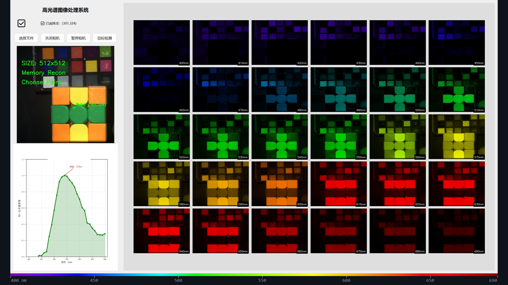

# dvd233

**AI Application Engineer**

I build reliable AI applications across frontend and client systems, grounded in computational imaging and evidence-first engineering.

Open to AI application engineering opportunities.

构建可靠的 AI 应用与前端/客户端体验，以计算成像和证据驱动工程形成技术纵深。

<!-- PUBLICATION GATE: the poster below links to the local sanitized derivative.
     Before publishing, replace the href with the public GitHub-hosted video URL
     (uploaded attachment or agreed platform) after media QA passes. -->

Earlier private prototype · co-developed in a two-person team · sanitized demo, publication pending · wavelength ruler marks the real 400–690 nm reconstruction range

## What the demo shows

A desktop hyperspectral reconstruction workflow: camera acquisition, lightweight deep-learning reconstruction, 30-band spectral display across 400–690 nm, and per-point spectral curves — research code running as a usable interface.

I was responsible for the lightweight deep-learning reconstruction and dataset work, plus the camera acquisition, desktop UI, spectral visualization, and result-saving modules. Code and data remain private due to research and industry-collaboration constraints.

## Open-source contributions

Snapshot · 26 Aug 2026 — 23 merged PRs in [`open-city-ai/haidian`](https://github.com/open-city-ai/haidian). The five examples below are selected for distinct evidence value; open and closed-unmerged work is not counted.

### Complete delivery · Bilingual formal submission

- **Problem** — Formal repository intake required a complete, reviewable package rather than an unsupported concept.
- **Contribution** — I delivered a scoped 41-file bilingual package spanning narrative, offline HTML/PDF, GeoJSON, metrics, sources, manifest, and deterministic self-checks, while marking provisional geometry and non-endorsement boundaries.
- **Status** — Merged for repository intake on 14 Aug 2026; not gallery publication, implementation approval, or government endorsement.
- **Evidence** — [`open-city-ai/haidian#2540` — Submit THE DATA CO-OP LINE](https://github.com/open-city-ai/haidian/pull/2540)

### Auditable evidence · Site provenance

- **Problem** — Provisional site inputs lacked consistent dates, hashes, licence and use boundaries, while an empty constraints layer could be mistaken for evidence that no real-world controls existed.
- **Contribution** — I added a built-ins-only audit that verified four submitted geometries, recorded six missing official-control layers, and made replacement triggers and permitted uses traceable across the package.
- **Status** — Merged on 20 Aug 2026 with 18/18 audit checks passing; the geometry remains explicitly provisional.
- **Evidence** — [`open-city-ai/haidian#3525` — Make site evidence auditable](https://github.com/open-city-ai/haidian/pull/3525)

### Windows portability · Import and worker locking

- **Problem** — An unconditional `fcntl` import prevented two test modules from even being collected on Windows, and worker-lock contention needed consistent cross-platform semantics.
- **Contribution** — I reproduced the Windows failure, introduced the guarded POSIX/Windows lock path, and added the initial regression. Maintainer review then corrected the production file-open path and strengthened its test before merge.
- **Status** — Merged on 23 Aug 2026 after change-request and exact-head re-review; the previously uncollectable target suite passed 21/21 tests.
- **Evidence** — [`open-city-ai/haidian#3859` — Keep the review queue importable and lockable on Windows](https://github.com/open-city-ai/haidian/pull/3859)

### Deterministic artifacts · LF across platforms

- **Problem** — Three writer paths emitted CRLF on Windows, creating whole-file diff noise and breaking byte-hash consistency after line-ending normalization.
- **Contribution** — I made the writers emit LF bytes and added direct plus end-to-end regressions; after review exposed a Python 3.9 compatibility issue, I revised the implementation and revalidated both flows.
- **Status** — Merged on 24 Aug 2026 after independent Python 3.9 verification.
- **Evidence** — [`open-city-ai/haidian#3915` — Emit LF-only participant-flow artifacts](https://github.com/open-city-ai/haidian/pull/3915)

### Review semantics · Blockers versus future follow-ups

- **Problem** — A flat review-action list converted future conditions into immediate change requests, creating an intake loop that compliant edits could not close.
- **Contribution** — I introduced explicit non-blocking follow-ups with trigger and owner fields, invalidated legacy review caches, and kept current or malformed repairs fail-closed with focused regression coverage.
- **Status** — Merged on 24 Aug 2026; the original blocked exact head was subsequently re-reviewed and merged without weakening existing gates.
- **Evidence** — [`open-city-ai/haidian#3982` — Separate future follow-ups from intake blockers](https://github.com/open-city-ai/haidian/pull/3982)

## Engineering focus

- **AI applications** — shaping agent and LLM capabilities into reliable product experiences.
- **Frontend & client systems** — delivering interactive desktop and web software with cross-platform discipline.
- **Computational imaging** — bringing reconstruction research into usable software while preserving evidence and privacy boundaries.
- **Evidence-first engineering** — making claims reviewable through auditable facts, deterministic tests, and traceable artifacts.

## Education

Master's student at BUPT · Electronic Engineering & Information Photonics 
Undergraduate background in Network Engineering at BUPT

## Contact

[dvd@linux.do](mailto:dvd@linux.do) · [z1403594118@gmail.com](mailto:z1403594118@gmail.com)
